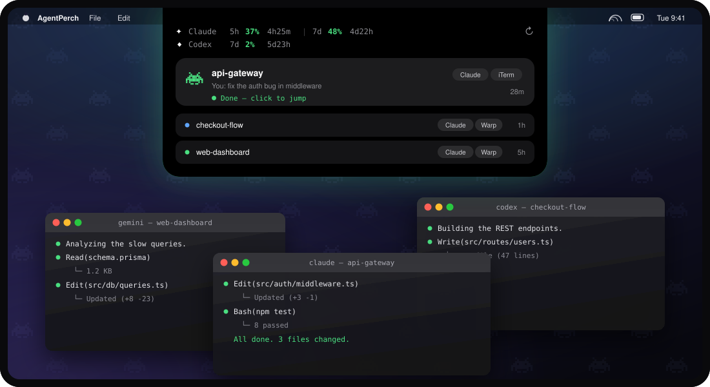
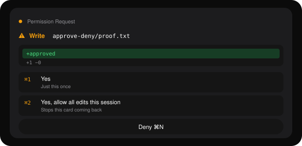
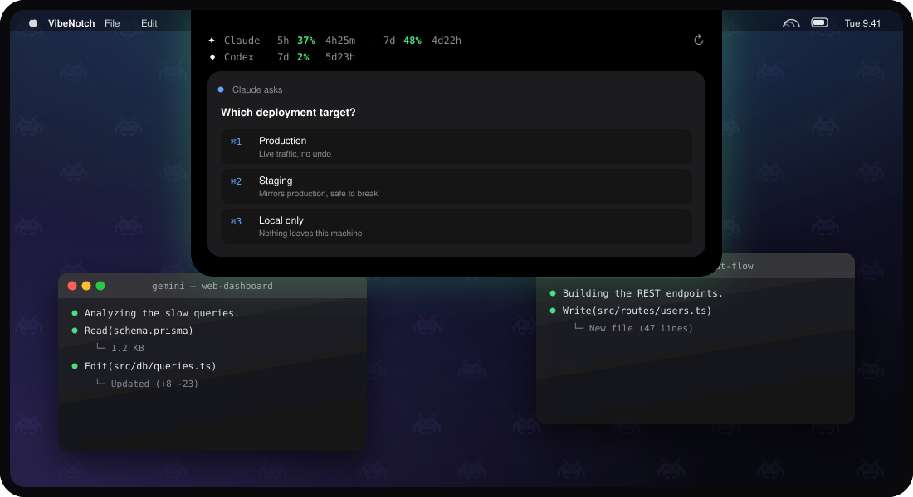
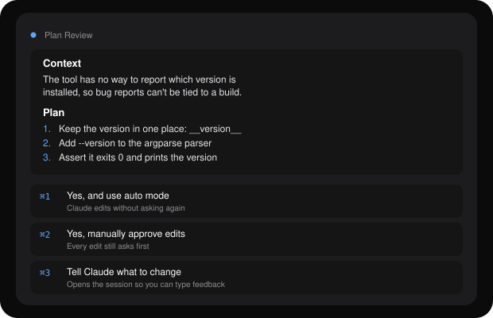

<div align="center">

# AgentPerch

### Your AI agents live in the notch now.

**Every Claude Code, Codex, Gemini and Antigravity session on your Mac — in one place, in the dead space around the camera. See what each one is doing. Answer its questions without leaving the app you're in. Click a card to land in the exact terminal tab running it.**

*Native Swift. No dock icon. No menu bar clutter. No account, no telemetry, no cost.*



</div>

---

## Why

You have five terminal tabs open. Two agents are working, one is waiting on a permission prompt, one finished four minutes ago, and one is stuck on a question you never saw. You find out by cycling through tabs.

AgentPerch puts all of them in the notch. Hover to see them. Answer from there.

**The rule the whole app is built on: a card never claims something it hasn't verified.** A spinner means a turn is genuinely in flight — confirmed by a hook, not guessed from a file timestamp. A green dot means a process is actually running. If a session died, its card says so and then leaves. It is very easy to build a panel that looks alive; this one tries hard to be honest instead.

---

## What it does

### See every agent at a glance

Live status, the current action, elapsed time and tokens for the turn. Agent and terminal pills tell you what's running where. Quota for every provider you use sits along the top.

### Answer without switching apps



When an agent stops to ask, the card shows **what** it's asking — the tool, the file, a diff of the change — not just that it's asking. Hit <kbd>⌘1</kbd> to allow, <kbd>⌘2</kbd> to allow for the rest of the session, <kbd>⌘N</kbd> to deny. The keystroke goes into the right terminal tab, even if you're in a browser.

### Pick an option from a question



`AskUserQuestion` prompts render as real numbered choices. <kbd>⌘1</kbd>–<kbd>⌘9</kbd> answers them.

### Review a plan



Plan mode gets a proper markdown card, and all three of the real choices — including "use auto mode", which is what <kbd>⌘1</kbd> actually does. No button that quietly means something bigger than it says.

### Jump to the exact tab

Click any card and the terminal running it comes to the front — the right window, the right tab, even when several sessions share one folder.

---

## Install

Requires **macOS 14+** on Apple Silicon.

### **[Download AgentPerch.dmg →](https://github.com/guillezorrilla/agent-perch/releases/latest)**

Open it, drag AgentPerch to Applications, launch it. The build is signed and notarized, so there's no right-click dance and no "damaged and can't be opened".

That's it. There's no installer and no dock icon — AgentPerch lives in the notch. Quit it from **Settings → Quit**.

<details>
<summary>Or build it yourself</summary>

Needs Xcode and a Swift 6 toolchain.

```sh
git clone https://github.com/guillezorrilla/agent-perch.git
cd agent-perch
make app
open AgentPerch.app
```

</details>

On first launch macOS will ask for two things:

| Prompt | Why |
|---|---|
| **Accessibility** | To type your answer into the terminal for you |
| **Access data from other apps** | To read Warp's tab list, so a jump lands on the right tab |

Both are optional. Decline them and AgentPerch still shows everything — it just opens a fresh tab instead of focusing an exact one, and you answer prompts by hand.

### Live status for Claude Code

Cards work out of the box from transcript files. For **real-time** status — working / needs-action / done, the current tool, token counts, and the answer shortcuts — install the hooks from **Settings → Install hooks**. It writes a small script and registers it in `~/.claude/settings.json`.

---

## Using it

| | |
|---|---|
| **Hover the notch** | Open the panel |
| **Click a card** | Jump to that session's terminal tab |
| <kbd>⌘1</kbd>–<kbd>⌘9</kbd> | Pick an option on the topmost card |
| <kbd>⌘Y</kbd> | Allow |
| <kbd>⌘N</kbd> | Deny — sends Escape, which cancels any prompt shape |

Shortcuts work anywhere: the panel doesn't need focus, and neither does the terminal.

---

## What it watches

**Agents** — Claude Code, Codex, Gemini, OpenCode, Kiro, Cursor, Antigravity (app + CLI).

**Terminals**, best jump first:

| Terminal | How it finds your tab |
|---|---|
| iTerm2, Terminal.app | tty — exact |
| WezTerm | `wezterm cli list` — exact |
| Warp | pane/process pairing — exact, including two sessions in one folder |
| Ghostty, cmux | matched by working directory |
| tmux | pane-level |
| anything else | opens a new tab at the right path |

**Quota** — Claude, Codex, Antigravity, Kiro and Gemini, each toggleable in Settings.

---

## Settings

- **Display mode** — hover only, always show, or hidden
- **Which display** — follow your focused window, the built-in notch, or the menu-bar display
- **Needs-action dwell** — how long an alert holds the panel open (off / 3s / 5s / 10s)
- **Usage providers** — show only the quotas you care about
- **Install hooks** — turn on live Claude Code status
- **Updates** — check daily and tell you when there's a new version. It links to the download rather than replacing itself: swapping the bundle out from under macOS would revoke the Accessibility and app-data grants, and the app would keep showing cards while answers quietly stopped landing

---

## Development

```sh
swift build          # debug
swift test           # 730 tests
make app             # assemble AgentPerch.app (release, signed)
```

`make app` signs with a stable Apple Development identity if you have one, so macOS keeps your Accessibility grant between builds. It updates the bundle in place for the same reason — deleting and recreating the `.app` throws those grants away.

Built on [DynamicNotchKit](https://github.com/MrKai77/DynamicNotchKit).

---

## Roadmap

- Exact jump for Kitty and Zellij
- Goose session discovery
- Custom sound packs
- SSH remote session monitoring

---

<div align="center">
<sub>Built by <a href="https://github.com/guillezorrilla">Guille Zorrilla</a>.</sub>
</div>
